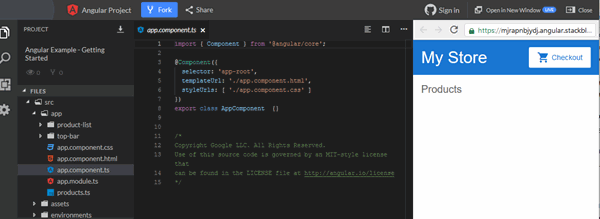

# Getting started with Angular

Welcome to Angular!

This tutorial introduces you to the essentials of Angular by walking you through building an e-commerce site with a catalog, shopping cart, and check-out form.

To help you get started right away, this tutorial uses a ready-made application that you can examine and modify interactively on [StackBlitz](https://stackblitz.com/) —without having to [set up a local work environment](https://v17.angular.io/guide/setup-local). StackBlitz is a browser-based development environment where you can create, save, and share projects using a variety of technologies.

---

## Prerequisites

To get the most out of this tutorial, you should already have a basic understanding of the following.

- [HTML](https://developer.mozilla.org/pt-BR/docs/Learn/HTML)
- [JavaScript](https://developer.mozilla.org/pt-BR/docs/Web/JavaScript)
- [TypeScript](https://www.typescriptlang.org/)

---

## Take a tour of the example application

You build Angular applications with components. Components define areas of responsibility in the UI that let you reuse sets of UI functionality.

A component consists of three things:

| Component Part            | Details                        |
| ------------------------- | ------------------------------ |
| A component class         | Handles data and functionality |
| An HTML template          | Determines the UI              |
| Component-specific styles | Define the look and feel       |

This guide demonstrates building an application with the following components:

| Components           | Details                                                                |
| -------------------- | ---------------------------------------------------------------------- |
| <app-root>           | The first component to load and the container for the other components |
| <app-top-bar>        | The store name and checkout button                                     |
| <app-product-list>   | The product list                                                       |
| <app-product-alerts> | A component that contains the application's alerts                     |


For more information about components, see [Introduction to Components](https://v17.angular.io/guide/architecture-components).

---

## Create the sample project

To create the sample project, generate the [ready-made sample project in StackBlitz](https://v17.angular.io/generated/live-examples/getting-started-v0/stackblitz.html). To save your work:

1. Log into StackBlitz.
2. Fork the project you generated.
3. Save periodically.


In StackBlitz, the preview pane on the right shows the starting state of the example application. The preview features two areas:

- A top bar with the store name, `My Store`, and a checkout button
- A header for a product list, `Products`



The project section on the left shows the source files that make up the application, including the infrastructure and configuration files.

When you generate the StackBlitz example applications that accompany the tutorials, StackBlitz creates the starter files and mock data for you. The files you use throughout the tutorial are in the `src` folder.

For more information on how to use StackBlitz, see the [StackBlitz documentation](https://developer.stackblitz.com/).

## Create the product list

In this section, you'll update the application to display a list of products. You'll use predefined product data from the `products.ts` file and methods from the `product-list.component.ts` file. This section guides you through editing the HTML, also known as the template.

1. In the `product-list` folder, open the template file `product-list.component.html`.

2. Add an *[`ngFor`](https://v17.angular.io/api/common/NgFor) structural directive on a `<div>`, as follows.

```html
<!-- src/app/product-list/product-list.component.html -->
<h2>Products</h2>

<div *ngFor="let product of products"></div>
```

With *[`ngFor`](https://v17.angular.io/api/common/NgFor), the `<div>` repeats for each product in the list.

Structural directives shape or reshape the DOM's structure, by adding, removing, and manipulating elements. For more information about structural directives, see [Structural directives](https://v17.angular.io/guide/structural-directives).

3. Inside the `<div>`, add an `<h3>` and `{{ product.name }}`. The `{{ product.name }}` statement is an example of Angular's interpolation syntax. Interpolation `{{ }}` lets you render the property value as text.

```html
<!-- src/app/product-list/product-list.component.html -->
<h2>Products</h2>

<div *ngFor="let product of products">
  <h3>{{ product.name }}</h3>
</div>
```

The preview pane updates to display the name of each product in the list.


4. To make each product name a link to product details, add the `<a>` element around `{{ product.name }}`.

5. Set the title to be the product's name by using the property binding `[ ]` syntax, as follows:

```html
<!-- src/app/product-list/product-list.component.html -->
<h2>Products</h2>

<div *ngFor="let product of products">
  <h3>
    <a [title]="product.name + ' details'"> {{ product.name }} </a>
  </h3>
</div>
```

In the preview pane, hover over a product name to see the bound name property value, which is the product name plus the word "details". Property binding `[ ]` lets you use the property value in a template expression.


6. Add the product descriptions. On a `<p>` element, use an *[`ngIf`](https://v17.angular.io/api/common/NgIf) directive so that Angular only creates the `<p>` element if the current product has a description.

```html
<!-- src/app/product-list/product-list.component.html -->
<h2>Products</h2>

<div *ngFor="let product of products">
  <h3>
    <a [title]="product.name + ' details'"> {{ product.name }} </a>
  </h3>

  <p *ngIf="product.description">Description: {{ product.description }}</p>
</div>
```

The application now displays the name and description of each product in the list. Note that the final product does not have a description paragraph. Angular doesn't create the `<p>` element because the product's description property is empty.


7. Add a button so users can share a product. Bind the button's `click` event to the `share()` method in `product-list.component.ts`. Event binding uses a set of parentheses, `( )`, around the event, as in the `(click)` event on the `<button>` element.

```html
<!-- src/app/product-list/product-list.component.html -->
<h2>Products</h2>

<div *ngFor="let product of products">
  <h3>
    <a [title]="product.name + ' details'"> {{ product.name }} </a>
  </h3>

  <p *ngIf="product.description">Description: {{ product.description }}</p>

  <button type="button" (click)="share()">Share</button>
</div>
```

Each product now has a Share button.


Clicking the Share button triggers an alert that states, "The product has been shared!".


In editing the template, you have explored some of the most popular features of Angular templates. For more information, see [Introduction to components and templates](https://v17.angular.io/guide/architecture-components#template-syntax).

## Pass data to a child component

Currently, the product list displays the name and description of each product. The ***ProductListComponent*** also defines a ***products*** property that contains imported data for each product from the ***products*** array in ***products.ts***.

The next step is to create a new alert feature that will use product data from the ***ProductListComponent***. The alert should check the product's price. If it is found to be greater than $700, a Notify Me button should be displayed. When a user clicks on the button, they should be able to sign up for notifications that will inform them when the product goes on sale.

This section walks you through creating a child component, ***ProductAlertsComponent***, that can receive data from its parent component, ***ProductListComponent***.

1. Click on the plus sign above the current terminal to create a new terminal to run the command to generate the component.


2. In the new terminal, generate a new component named ***product-alerts*** by running the following command:

```bash
ng generate component product-alerts
```

The generator creates starter files for the three parts of the component:
  - product-alerts.component.ts
  - product-alerts.component.html
  - product-alerts.component.css

3. Open ***product-alerts.component.ts***. The [`@Component()`](https://v17.angular.io/api/core/Component) decorator indicates that the following class is a component. [`@Component()`](https://v17.angular.io/api/core/Component) also provides metadata about the component, including its selector, templates, and styles.

```ts
// src/app/product-alerts/product-alerts.component.ts
@Component({
  selector: 'app-product-alerts',
  templateUrl: './product-alerts.component.html',
  styleUrls: ['./product-alerts.component.css']
})
export class ProductAlertsComponent {


}
```

Key features in the [`@Component()`](https://v17.angular.io/api/core/Component) are as follows:

The ***selector***, ***app-product-alerts***, identifies the component. By convention, Angular component selectors begin with the prefix ***app-***, followed by the component name.

The template and style filenames reference the component's HTML and CSS

4. The [`@Component()`](https://v17.angular.io/api/core/Component) definition also exports the class, ***ProductAlertsComponent***, which handles functionality for the component

To set up ***ProductAlertsComponent*** to receive product data, first import [Input](https://v17.angular.io/api/core/Input) from ***@angular/core***.

```ts
// src/app/product-alerts/product-alerts.component.ts
import { Component, Input } from '@angular/core';
import { Product } from '../products';
```

5. In the ***ProductAlertsComponent*** class definition, define a property named ***product*** with an [`@Input()`](https://v17.angular.io/api/core/Input) decorator. The [`@Input()`](https://v17.angular.io/api/core/Input) decorator indicates that the property value passes in from the component's parent, ***ProductListComponent***.

```ts
// src/app/product-alerts/product-alerts.component.ts
export class ProductAlertsComponent {

  @Input() product: Product | undefined;

}
```

6. Open ***product-alerts.component.html*** and replace the placeholder paragraph with a Notify Me button that appears if the product price is over $700.

```html
<!-- src/app/product-alerts/product-alerts.component.html -->
<p *ngIf="product && product.price > 700">
  <button type="button">Notify Me</button>
</p>
```

7. The generator automatically added the ***ProductAlertsComponent*** to the ***AppModule*** to make it available to other components in the application.

```ts
// src/app/app.module.ts
import { ProductAlertsComponent } from './product-alerts/product-alerts.component';

@NgModule({
  declarations: [
    AppComponent,
    TopBarComponent,
    ProductListComponent,
    ProductAlertsComponent,
  ],
```

Finally, to display ***ProductAlertsComponent*** as a child of ***ProductListComponent***, add the ***<app-product-alerts>*** element to ***product-list.component.html***. Pass the current product as input to the component using property binding.

```html
<!-- src/app/product-list/product-list.component.html -->
<button type="button" (click)="share()">
  Share
</button>

<app-product-alerts
  [product]="product">
</app-product-alerts>
```

The new product alert component takes a product as input from the product list. With that input, it shows or hides the Notify Me button, based on the price of the product. The Phone XL price is over $700, so the Notify Me button appears on that product.


# Pass data to a parent component

