# ASP.NET Core

## Install ASP.NET Core and TypeScript

First, install [ASP.NET Core](https://dotnet.microsoft.com/apps/aspnet) if you need it. This quick-start guide requires Visual Studio 2015 or 2017.

Next, if your version of Visual Studio does not already have the latest TypeScript, you can [install it](https://www.typescriptlang.org/#download-links).

## Create a new project

1. Choose **File**
2. Choose **New Project** (Ctrl + Shift + N)
3. Search for **.NET Core** in the project search bar
4. Select **ASP.NET Core Web Application** and press the *Next* button

5. Name your project and solution. After select the *Create* button
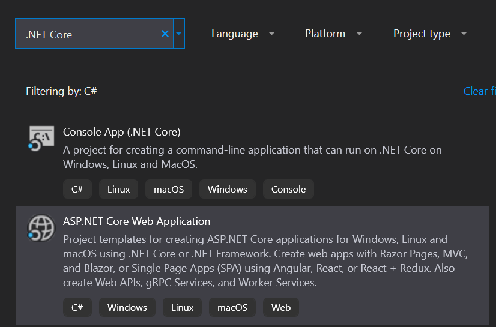
6. In the last window, select the **Empty** template and press the *Create* button
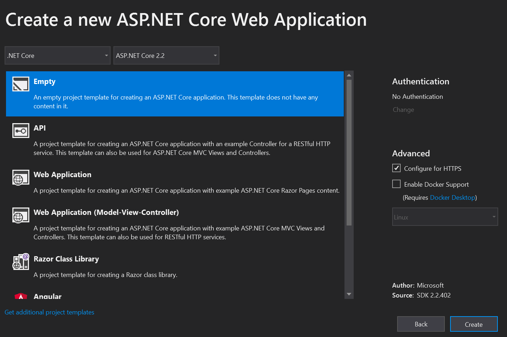

Run the application and make sure that it works.

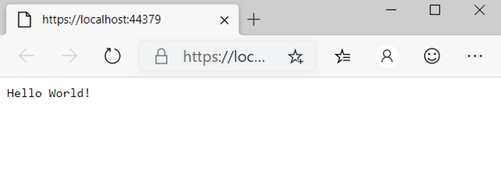

### Set up the server

Open **Dependencies > Manage NuGet Packages > Browse.** Search and install `Microsoft.AspNetCore.StaticFiles` and `Microsoft.TypeScript.MSBuild`:

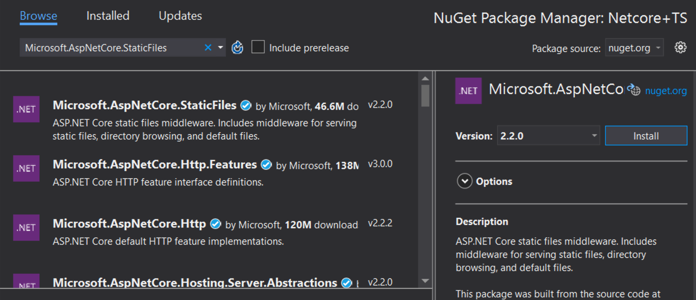

Open up your `Startup.cs` file and edit your `Configure` function to look like this:

```cs
public void Configure(IApplicationBuilder app, IHostEnvironment env)
{
    if (env.IsDevelopment())
    {
        app.UseDeveloperExceptionPage();
    }

    app.UseDefaultFiles();
    app.UseStaticFiles();
}
```

You may need to restart VS for the red squiggly lines below `UseDefaultFiles` and `UseStaticFiles` to disappear.

## Add TypeScript

Next we will add a new folder and call it `scripts`.
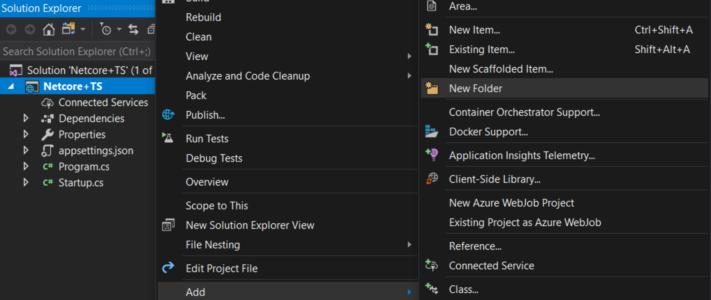
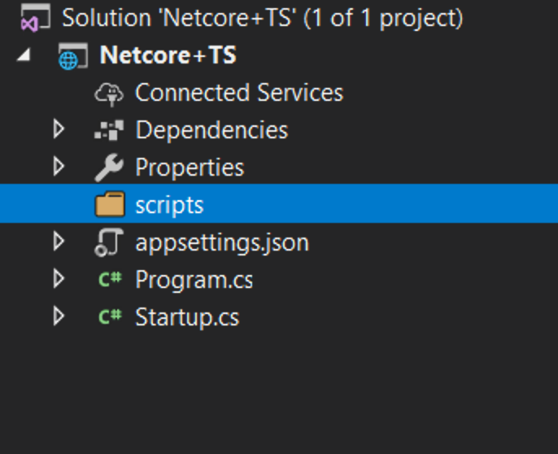

## Add TypeScript code

Right click on `scripts` and click **New Item**. Then choose **TypeScript File** and name the file `app.ts`
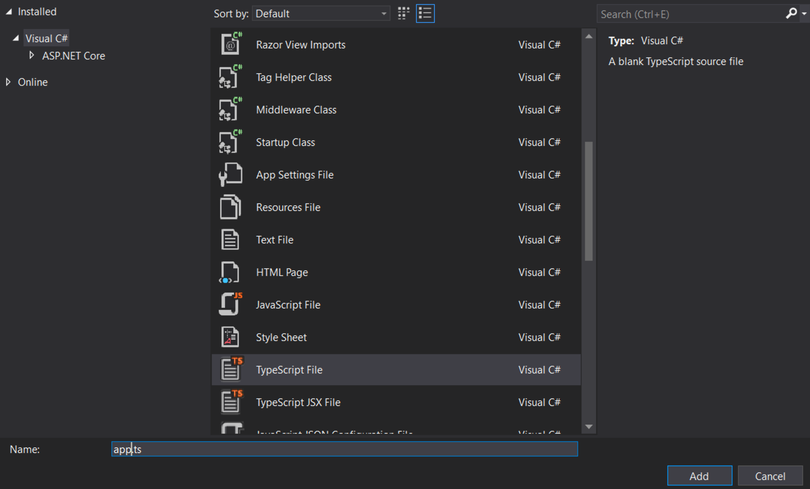

### Add example code

Add the following code to the `app.ts` file.

```ts
function sayHello() {
  const compiler = (document.getElementById("compiler") as HTMLInputElement)
    .value;
  const framework = (document.getElementById("framework") as HTMLInputElement)
    .value;
  return `Hello from ${compiler} and ${framework}!`;
}
```
## Set up the build

*Configure the TypeScript compiler*

First we need to tell TypeScript how to build. Right click on `scripts` and click **New Item**. Then choose **TypeScript Configuration File** and use the default name of `tsconfig.json`

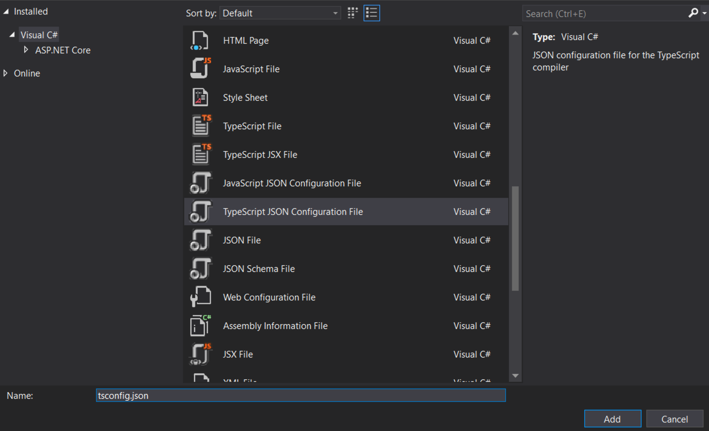

Replace the contents of the `tsconfig.json` file with:

```json
{
  "compilerOptions": {
    "noEmitOnError": true,
    "noImplicitAny": true,
    "sourceMap": true,
    "target": "es6"
  },
  "files": ["./app.ts"],
  "compileOnSave": true
}
```

- [noEmitOnError](https://www.typescriptlang.org/tsconfig/#noEmitOnError) : Do not emit outputs if any errors were reported.
- [noImplicitAny](https://www.typescriptlang.org/tsconfig/#noImplicitAny) : Raise error on expressions and declarations with an implied `any` type.
- [sourceMap](https://www.typescriptlang.org/tsconfig/#sourceMap) : Generates corresponding `.map` file.
- [target](https://www.typescriptlang.org/tsconfig/#target) : Specify ECMAScript target version.

Note: `"ESNext"` targets latest supported

[noImplicitAny](https://www.typescriptlang.org/tsconfig/#noImplicitAny) is good idea whenever you’re writing new code — you can make sure that you don’t write any untyped code by mistake. `"compileOnSave"` makes it easy to update your code in a running web app.

### ***Set up NPM***

We need to setup NPM so that JavaScript packages can be downloaded. Right click on the project and select **New Item**. Then choose **NPM Configuration File** and use the default name of `package.json`.

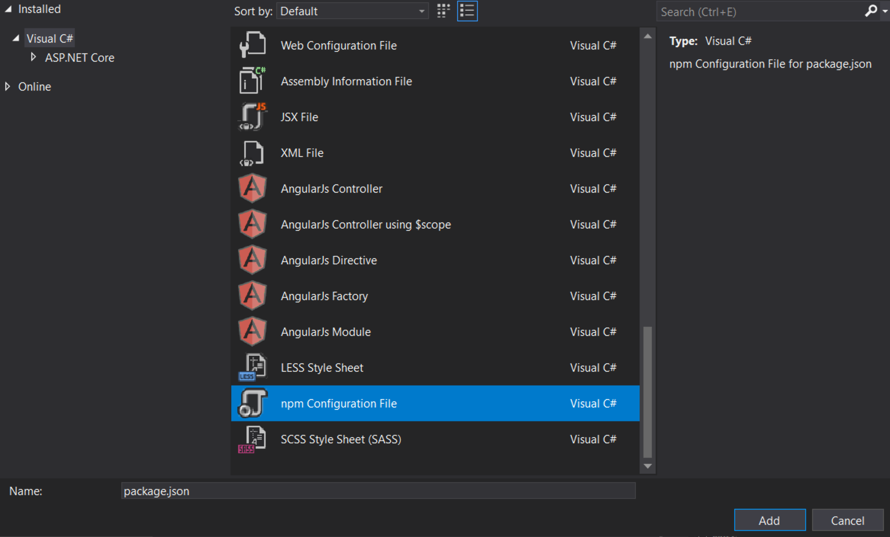

Inside the `"devDependencies"` section of the `package.json` file, add *gulp* and *del*

```json
"devDependencies": {
    "gulp": "4.0.2",
    "del": "5.1.0"
}
```

Visual Studio should start installing gulp and del as soon as you save the file. If not, right-click package.json and then Restore Packages.

After you should see an `npm` folder in your solution explorer

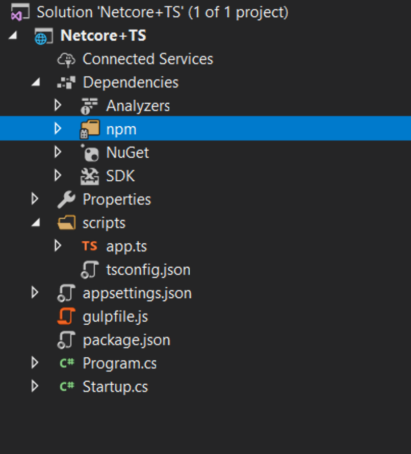

### ***Set up gulp***

Right click on the project and click **New Item**. Then choose **JavaScript File** and use the name of `gulpfile.js`

```js
/// <binding AfterBuild='default' Clean='clean' />
/*
This file is the main entry point for defining Gulp tasks and using Gulp plugins.
Click here to learn more. http://go.microsoft.com/fwlink/?LinkId=518007
*/
var gulp = require("gulp");
var del = require("del");
var paths = {
  scripts: ["scripts/**/*.js", "scripts/**/*.ts", "scripts/**/*.map"],
};
gulp.task("clean", function () {
  return del(["wwwroot/scripts/**/*"]);
});
gulp.task("default", function (done) {
    gulp.src(paths.scripts).pipe(gulp.dest("wwwroot/scripts"));
    done();
});
```
The first line tells Visual Studio to run the task ‘default’ after the build finishes. It will also run the ‘clean’ task when you ask Visual Studio to clean the build.

Now right-click on `gulpfile.js` and click Task Runner Explorer.

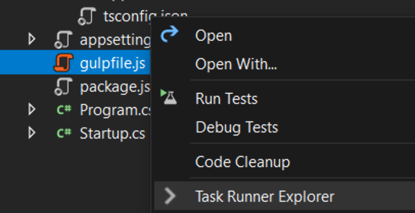

If ‘default’ and ‘clean’ tasks don’t show up, refresh the explorer:

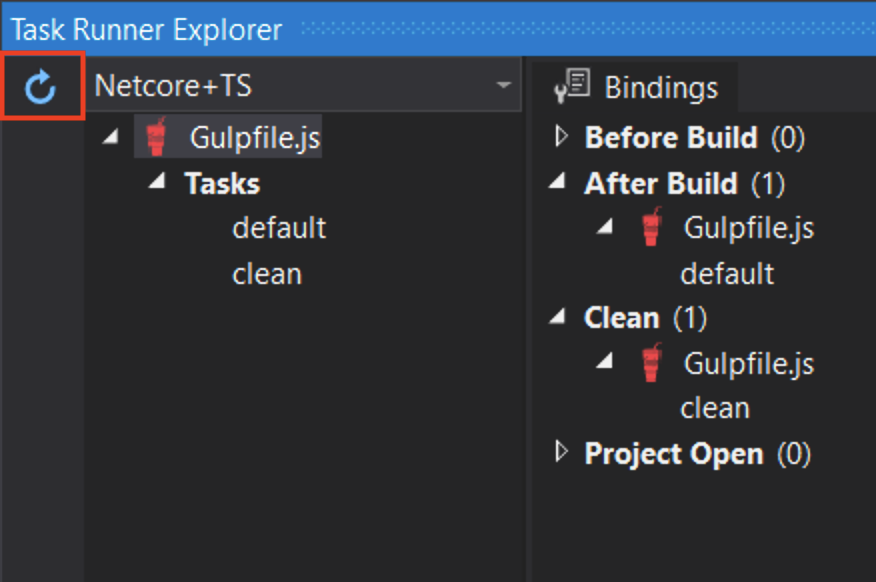

## Write a HTML page

Right click on the `wwwroot` folder (if you don’t see the folder try building the project) and add a New Item named `index.html` inside. Use the following code for `index.html`

```html
<!DOCTYPE html>
<html>
<head>
    <meta charset="utf-8" />
    <script src="scripts/app.js"></script>
    <title></title>
</head>
<body>
    <div id="message"></div>
    <div>
        Compiler: <input id="compiler" value="TypeScript" onkeyup="document.getElementById('message').innerText = sayHello()" /><br />
        Framework: <input id="framework" value="ASP.NET" onkeyup="document.getElementById('message').innerText = sayHello()" />
    </div>
</body>
</html>
```

## Test

1. Run the project
2. As you type on the boxes you should see the message appear/change!
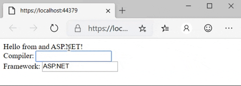

## Debug

1. In Edge, press F12 and click the Debugger tab.
2. Look in the first localhost folder, then scripts/app.ts
3. Put a breakpoint on the line with return.
4. Type in the boxes and confirm that the breakpoint hits in TypeScript code and that inspection works correctly.

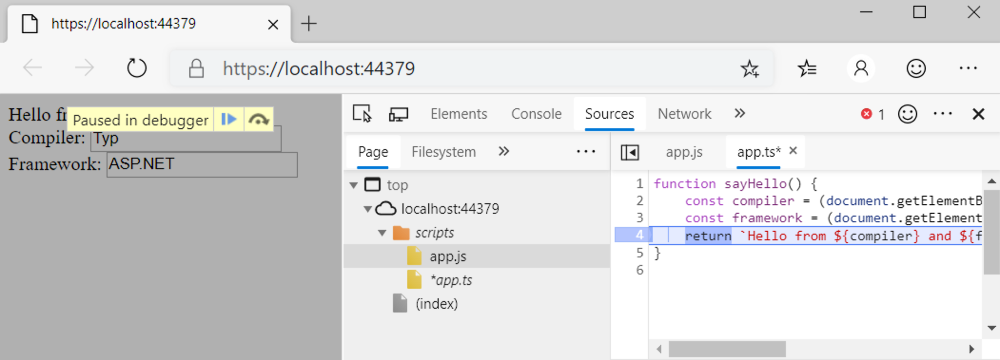

Congrats you’ve built your own .NET Core project with a TypeScript frontend.