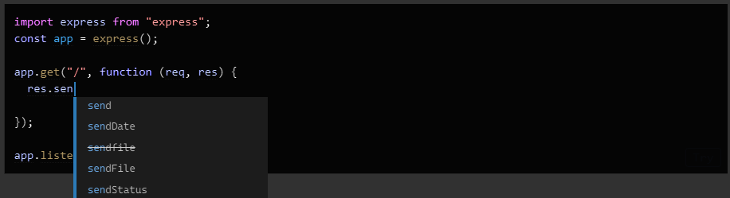

# O Básico

Bem-vindo à primeira página do manual. Se esta é a sua primeira experiência com TypeScript, você pode querer começar por um dos guias de 'Introdução'.

Cada valor em JavaScript tem um conjunto de comportamentos que você pode observar ao executar diferentes operações. Isso pode parecer abstrato, mas, como um exemplo rápido, considere algumas operações que podemos realizar em uma variável chamada `message`.

```javascript
// Acessando a propriedade 'toLowerCase'
// em 'message' e, em seguida, chamando-a
message.toLowerCase();
// Chamando 'message'
message();
```

Se analisarmos isso, a primeira linha executável de código acessa uma propriedade chamada `toLowerCase` e a chama. A segunda tenta chamar `message` diretamente.

Mas assumindo que não sabemos o valor de `message` - e isso é bastante comum - não podemos afirmar de forma confiável quais resultados obteremos ao tentar executar qualquer um desses códigos. O comportamento de cada operação depende totalmente do valor que tínhamos em primeiro lugar.

- `message` é chamável?
- Ele tem uma propriedade chamada `toLowerCase`?
- Se tiver, `toLowerCase` é chamável?
- Se ambos esses valores são chamáveis, o que eles retornam?

As respostas a essas perguntas são geralmente coisas que mantemos em mente ao escrever JavaScript, e temos que torcer para que tenhamos acertado todos os detalhes.

Vamos supor que `message` foi definido da seguinte maneira.

```javascript
const message = "Hello World!";
```

Como você pode imaginar, se tentarmos executar `message.toLowerCase()`, obteremos a mesma string, mas em minúsculas.

E quanto à segunda linha de código? Se você está familiarizado com JavaScript, saberá que isso falha com uma exceção:

```sh
TypeError: message is not a function
```

Seria ótimo se pudéssemos evitar erros como esse.

Quando executamos nosso código, a forma como o tempo de execução do JavaScript decide o que fazer é identificando o tipo do valor - quais comportamentos e capacidades ele tem. Isso é parte do que o `TypeError` está indicando - está dizendo que a string `"Hello World!"` não pode ser chamada como uma função.

Para alguns valores, como os primitivos `string` e `number`, podemos identificar seu tipo em tempo de execução usando o operador `typeof`. Mas para outras coisas, como funções, não há um mecanismo correspondente em tempo de execução para identificar seus tipos. Por exemplo, considere esta função:

```javascript
function fn(x) {
  return x.flip();
}
```

Podemos observar lendo o código que essa função só funcionará se receber um objeto com uma propriedade `flip` chamável, mas o JavaScript não exibe essa informação de uma forma que possamos verificar enquanto o código está sendo executado. A única maneira em JavaScript puro de saber o que `fn` faz com um valor específico é chamá-lo e ver o que acontece. Esse tipo de comportamento torna difícil prever o que o código fará antes de executá-lo, o que significa que é mais difícil saber o que seu código vai fazer enquanto você o escreve.

Visto dessa forma, um tipo é o conceito de descrever quais valores podem ser passados para `fn` e quais irão falhar. JavaScript realmente fornece apenas tipagem dinâmica - executando o código para ver o que acontece.

A alternativa é usar um sistema de tipos estático para fazer previsões sobre o que o código deve fazer antes de executá-lo.

## Verificação de Tipos Estática

Pense naquele `TypeError` que obtivemos anteriormente ao tentar chamar uma `string` como se fosse uma função. A maioria das pessoas não gosta de encontrar erros ao executar seu código — esses são considerados bugs! E quando escrevemos um novo código, tentamos ao máximo evitar a introdução de novos bugs.

Se adicionarmos apenas um pouco de código, salvamos nosso arquivo, reexecutamos o código e imediatamente vemos o erro, podemos isolar o problema rapidamente; mas nem sempre é assim. Talvez não tenhamos testado a funcionalidade de forma suficiente, então talvez nunca encontramos um erro potencial que seria lançado! Ou, se tivermos a sorte de testemunhar o erro, podemos ter feito grandes refatorações e adicionado um monte de código diferente, o que nos força a vasculhar tudo.

Idealmente, teríamos uma ferramenta que nos ajudasse a encontrar esses bugs antes que nosso código seja executado. É isso que um verificador de tipos estáticos como o TypeScript faz. *Sistemas de tipos estáticos* descrevem as formas e comportamentos dos valores quando executamos nossos programas. Um verificador de tipos como o TypeScript usa essas informações e nos avisa quando algo pode estar saindo dos trilhos.

```typescript
const message = "hello!";
 
message();
Esta expressão não é chamável.
O tipo 'String' não possui assinaturas de chamada.
```

Executar o último exemplo com o TypeScript nos dará uma mensagem de erro antes mesmo de rodarmos o código.

## Falhas Não Relacionadas a Exceções

Até agora, estivemos discutindo certos aspectos como erros de tempo de execução — casos em que o tempo de execução do JavaScript nos diz que acha que algo é sem sentido. Esses casos surgem porque a [especificação ECMAScript](https://tc39.github.io/ecma262/) tem instruções explícitas sobre como a linguagem deve se comportar quando encontra algo inesperado.

Por exemplo, a especificação diz que tentar chamar algo que não é chamável deve lançar um erro. Talvez isso soe como um "comportamento óbvio", mas você poderia imaginar que acessar uma propriedade que não existe em um objeto também deveria lançar um erro. Em vez disso, o JavaScript nos dá um comportamento diferente e retorna o valor `undefined`:

```javascript
const user = {
  name: "Daniel",
  age: 26,
};
user.location; // retorna undefined
```

Em última análise, um sistema de tipos estático tem que decidir quais códigos devem ser marcados como erro em seu sistema, mesmo que sejam “códigos válidos” em JavaScript que não lançarão imediatamente um erro. No TypeScript, o seguinte código gera um erro sobre `location` não estar definido:

```typescript
const user = {
  name: "Daniel",
  age: 26,
};
 
user.location;
A propriedade 'location' não existe no tipo '{ name: string; age: number; }'.
```

Embora às vezes isso implique uma troca no que você pode expressar, o objetivo é capturar bugs legítimos em nossos programas. E o TypeScript captura muitos bugs legítimos.

Por exemplo: erros de digitação,

```typescript
const announcement = "Hello World!";
 
// Quão rapidamente você consegue identificar os erros de digitação?
announcement.toLocaleLowercase();
announcement.toLocalLowerCase();
 
// Provavelmente queríamos escrever isto...
announcement.toLocaleLowerCase();
```

funções não chamadas,

```typescript
function flipCoin() {
  // Deveria ser Math.random()
  return Math.random < 0.5;
O operador '<' não pode ser aplicado aos tipos '() => number' e 'number'.
}
```

ou erros básicos de lógica.

```typescript
const value = Math.random() < 0.5 ? "a" : "b";
if (value !== "a") {
  // ...
} else if (value === "b") {
Este comparação parece ser não intencional porque os tipos '"a"' e '"b"' não se sobrepõem.
  // Oops, inatingível
}
```

## Tipos para Ferramentas

O TypeScript pode capturar erros quando cometemos enganos em nosso código. Isso é ótimo, mas o TypeScript também pode nos ajudar a evitar cometer esses erros em primeiro lugar.

O verificador de tipos tem informações para checar se estamos acessando as propriedades corretas em variáveis e outras propriedades. Uma vez que ele tem essas informações, ele também pode começar a sugerir quais propriedades você pode querer usar.

Isso significa que o TypeScript pode ser aproveitado também para a edição de código, e o verificador de tipos central pode fornecer mensagens de erro e sugestões de código à medida que você digita no editor. Isso é parte do que as pessoas geralmente se referem quando falam sobre ferramentas no TypeScript.



O TypeScript leva as ferramentas a sério, e isso vai além de autocompletar e erros enquanto você digita. Um editor que suporta TypeScript pode oferecer “correções rápidas” para corrigir automaticamente erros, refatorações para reorganizar facilmente o código e recursos de navegação úteis para pular para definições de variáveis ou encontrar todas as referências a uma variável específica. Tudo isso é construído em cima do verificador de tipos e é totalmente multiplataforma, então é provável que [seu editor favorito tenha suporte para TypeScript disponível](https://github.com/Microsoft/TypeScript/wiki/TypeScript-Editor-Support).

## `tsc`, o Compilador TypeScript

Estamos falando sobre verificação de tipos, mas ainda não usamos nosso verificador de tipos. Vamos nos familiarizar com nosso novo amigo `tsc`, o compilador TypeScript. Primeiro, precisamos instalá-lo via npm.

```sh
npm install -g typescript
```

> Isso instala o Compilador TypeScript `tsc` globalmente. Você pode usar `npx` ou ferramentas semelhantes se preferir executar o `tsc` a partir de um pacote local `node_modules`.

Agora, vamos para uma pasta vazia e tentar escrever nosso primeiro programa TypeScript: `hello.ts`:

```typescript
// Saúda o mundo.
console.log("Hello world!");
```

Observe que não há nada de especial aqui; este programa “hello world” parece idêntico ao que você escreveria para um programa “hello world” em JavaScript. E agora vamos verificar o tipo executando o comando `tsc` que foi instalado para nós pelo pacote `typescript`.

```sh
tsc hello.ts
```

Tada!

Espere, “tada” *o quê exatamente*? Executamos o `tsc` e nada aconteceu! Bem, não houve erros de tipo, então não recebemos nenhuma saída no nosso console, pois não havia nada para relatar.

Mas olhe novamente - recebemos uma *saída de arquivo* em vez disso. Se olharmos no nosso diretório atual, veremos um arquivo `hello.js` ao lado de `hello.ts`. Esse é o output do nosso arquivo `hello.ts` depois que o `tsc` o compila ou transforma em um arquivo JavaScript simples. E se verificarmos o conteúdo, veremos o que o TypeScript gera após processar um arquivo `.ts`:

```typescript
// Saúda o mundo.
console.log("Hello world!");
```

Neste caso, havia muito pouco para o TypeScript transformar, então ele parece idêntico ao que escrevemos. O compilador tenta emitir código limpo e legível que pareça algo que uma pessoa escreveria. Embora isso nem sempre seja fácil, o TypeScript indenta de forma consistente, é atento ao fato de que nosso código pode se estender por diferentes linhas de código e tenta manter comentários por perto.

E se *introduzirmos* um erro de verificação de tipo? Vamos reescrever `hello.ts`:

```typescript
// Esta é uma função saudadora geral de nível industrial:
function greet(person, date) {
  console.log(`Hello ${person}, today is ${date}!`);
}
 
greet("Brendan");
```

Se executarmos `tsc hello.ts` novamente, note que recebemos um erro na linha de comando!

```sh
Esperado 2 argumentos, mas obtido 1.
```

O TypeScript está nos dizendo que esquecemos de passar um argumento para a função `greet`, e com razão. Até agora, só escrevemos JavaScript padrão, e ainda assim a verificação de tipos conseguiu encontrar problemas com nosso código. Obrigado, TypeScript!

#### #### #### #### #### #### #### #### #### #### #### #### #### #### #### #### #### #### #### #### #### #### #### #### #### #### #### #### #### #### #### #### 

## Emitindo com Erros

Uma coisa que você pode não ter notado no último exemplo foi que nosso arquivo `hello.js` mudou novamente. Se abrirmos esse arquivo, veremos que o conteúdo ainda parece basicamente o mesmo que o arquivo de entrada. Isso pode ser um pouco surpreendente, dado o fato de que o `tsc` relatou um erro sobre nosso código, mas isso se baseia em um dos valores centrais do TypeScript: muitas vezes, você saberá melhor do que o TypeScript.

Para reiterar, a verificação de tipos limita os tipos de programas que você pode executar, e há um trade-off sobre quais tipos de coisas um verificador de tipos considera aceitáveis. Na maioria das vezes, isso está bem, mas há cenários em que essas verificações podem atrapalhar. Por exemplo, imagine-se migrando código JavaScript para TypeScript e introduzindo erros de verificação de tipo. Eventualmente, você vai limpar as coisas para o verificador de tipos, mas aquele código JavaScript original já estava funcionando! Por que convertê-lo para TypeScript deveria impedir você de executá-lo?

Então, o TypeScript não impede você. Claro, com o tempo, você pode querer ser um pouco mais defensivo contra erros e fazer com que o TypeScript atue de forma um pouco mais rigorosa. Nesse caso, você pode usar a opção de compilador [noEmitOnError](https://www.typescriptlang.org/tsconfig/#noEmitOnError). Tente alterar seu arquivo `hello.ts` e executar o `tsc` com essa flag:

```sh
tsc --noEmitOnError hello.ts
```

Você notará que o `hello.js` nunca é atualizado.

# Tipos Explícitos

Até agora, não dissemos ao TypeScript quais são os tipos de `person` ou `date`. Vamos editar o código para informar ao TypeScript que `person` é um `string` e que `date` deve ser um objeto `Date`. Também usaremos o método `toDateString()` em `date`.

```typescript
function greet(person: string, date: Date) {
  console.log(`Hello ${person}, today is ${date.toDateString()}!`);
}
```

O que fizemos foi adicionar anotações de tipo em `person` e `date` para descrever com quais tipos de valores `greet` pode ser chamada. Você pode ler essa assinatura como “`greet` recebe um `person` do tipo string e um `date` do tipo `Date`”.

Com isso, o TypeScript pode nos informar sobre outros casos em que `greet` poderia ter sido chamada incorretamente. Por exemplo…

```typescript
function greet(person: string, date: Date) {
  console.log(`Hello ${person}, today is ${date.toDateString()}!`);
}
 
greet("Maddison", Date());
Argumento do tipo 'string' não é atribuível ao parâmetro do tipo 'Date'.
```

Hã? O TypeScript relatou um erro no nosso segundo argumento, mas por quê?

Talvez surpreendentemente, chamar `Date()` em JavaScript retorna uma `string`. Por outro lado, construir um `Date` com `new Date()` realmente nos dá o que esperávamos.

De qualquer forma, podemos corrigir o erro rapidamente:

```typescript
function greet(person: string, date: Date) {
  console.log(`Hello ${person}, today is ${date.toDateString()}!`);
}
 
greet("Maddison", new Date());
```

Tenha em mente que não precisamos sempre escrever anotações de tipo explícitas. Em muitos casos, o TypeScript pode até *inferir* (ou “descobrir”) os tipos para nós, mesmo que os omitamos.

```typescript
let msg = "hello there!";
    
let msg: string
```

Embora não tenhamos dito ao TypeScript que `msg` tinha o tipo `string`, ele foi capaz de descobrir isso. Isso é uma característica, e é melhor não adicionar anotações quando o sistema de tipos acabaria inferindo o mesmo tipo de qualquer maneira.

> Nota: A bolha de mensagem dentro do exemplo de código anterior é o que seu editor mostraria se você passasse o cursor sobre a palavra.

# Tipos Apagados

Vamos dar uma olhada no que acontece quando compilamos a função `greet` acima com o `tsc` para gerar JavaScript:

```typescript
"use strict";
function greet(person, date) {
    console.log("Hello ".concat(person, ", today is ").concat(date.toDateString(), "!"));
}
greet("Maddison", new Date());
```

Observe duas coisas aqui:
1. Nossos parâmetros `person` e `date` não têm mais anotações de tipo.
2. Nossa “string template” - aquela string que usava crase (o caractere `` ` ``) - foi convertida em strings simples com concatenações.

Mais sobre esse segundo ponto mais adiante, mas agora vamos nos concentrar no primeiro ponto. Anotações de tipo não são parte do JavaScript (ou ECMAScript para ser mais exato), então realmente não há navegadores ou outros tempos de execução que possam simplesmente executar TypeScript sem modificação. É por isso que o TypeScript precisa de um compilador em primeiro lugar - ele precisa de alguma maneira de remover ou transformar qualquer código específico do TypeScript para que você possa executá-lo. A maior parte do código específico do TypeScript é apagado, e da mesma forma, nossas anotações de tipo foram completamente apagadas.

> *Lembre-se*: Anotações de tipo nunca alteram o comportamento em tempo de execução do seu programa.

## Redução de Versão

Outra diferença do exemplo acima foi que nossa string template foi reescrita de

```typescript
`Hello ${person}, today is ${date.toDateString()}!`;
```

para

```typescript
"Hello ".concat(person, ", today is ").concat(date.toDateString(), "!");
```

Por que isso aconteceu?

As strings template são um recurso de uma versão do ECMAScript chamada ECMAScript 2015 (também conhecida como ECMAScript 6, ES2015, ES6, etc. - não pergunte). O TypeScript tem a capacidade de reescrever o código de versões mais novas do ECMAScript para versões mais antigas, como ECMAScript 3 ou ECMAScript 5 (também conhecida como ES5). Esse processo de mover de uma versão mais nova ou “superior” do ECMAScript para uma mais antiga ou “inferior” às vezes é chamado de *redução de versão*.

Por padrão, o TypeScript visa o ES5, uma versão extremamente antiga do ECMAScript. Poderíamos ter escolhido algo um pouco mais recente usando a opção [target](https://www.typescriptlang.org/tsconfig/#target). Executar com `--target es2015` muda o TypeScript para visar o ECMAScript 2015, o que significa que o código deve ser capaz de ser executado onde o ECMAScript 2015 é suportado. Então, executar `tsc --target es2015 hello.ts` nos dá a seguinte saída:

```typescript
function greet(person, date) {
  console.log(`Hello ${person}, today is ${date.toDateString()}!`);
}
greet("Maddison", new Date());
```

> Embora o alvo padrão seja ES5, a grande maioria dos navegadores atuais suporta ES2015. Portanto, a maioria dos desenvolvedores pode, com segurança, especificar ES2015 ou superior como alvo, a menos que a compatibilidade com certos navegadores antigos seja importante.

## Rigor

Usuários diferentes procuram coisas diferentes no TypeScript ao procurar um verificador de tipos. Algumas pessoas estão procurando uma experiência mais flexível, que pode ajudar a validar apenas algumas partes do seu programa e ainda ter uma boa ferramenta. Esta é a experiência padrão com TypeScript, onde os tipos são opcionais, a inferência assume os tipos mais permissivos e não há verificação para valores potencialmente `null/undefined`. Assim como o `tsc` emite mesmo diante de erros, essas configurações padrão são colocadas para não atrapalhar você. Se você está migrando JavaScript existente, isso pode ser um primeiro passo desejável.

Em contraste, muitos usuários preferem ter o TypeScript validando o máximo possível de imediato, e é por isso que a linguagem também oferece configurações de rigor. Essas configurações de rigor transformam a verificação estática de tipos de um interruptor (seu código é verificado ou não) em algo mais próximo de um controle. Quanto mais você aumenta esse controle, mais o TypeScript verificará para você. Isso pode exigir um pouco mais de trabalho, mas geralmente vale a pena a longo prazo e permite verificações mais completas e ferramentas mais precisas. Quando possível, um novo código base deve sempre ativar essas verificações de rigor.

O TypeScript tem várias flags de rigor na verificação de tipos que podem ser ativadas ou desativadas, e todos os nossos exemplos serão escritos com todas elas ativadas, a menos que especificado de outra forma. A flag [strict](https://www.typescriptlang.org/tsconfig/#strict) na CLI, ou `"strict": true` em um [tsconfig.json](https://www.typescriptlang.org/docs/handbook/tsconfig-json.html) ativa todas simultaneamente, mas podemos optar por desativá-las individualmente. As duas principais que você deve conhecer são [noImplicitAny](https://www.typescriptlang.org/tsconfig/#noImplicitAny) e [strictNullChecks](https://www.typescriptlang.org/tsconfig/#strictNullChecks).

## `noImplicitAny`

Lembre-se de que, em alguns lugares, o TypeScript não tenta inferir tipos para nós e, em vez disso, recai sobre o tipo mais permissivo: `any`. Isso não é a pior coisa que pode acontecer - afinal, recair sobre `any` é apenas a experiência de JavaScript puro.

No entanto, usar `any` muitas vezes derrota o propósito de usar o TypeScript em primeiro lugar. Quanto mais tipado seu programa é, mais validação e ferramentas você obterá, o que significa que você encontrará menos bugs enquanto codifica. Ativar a flag [noImplicitAny](https://www.typescriptlang.org/tsconfig/#noImplicitAny) gerará um erro em qualquer variável cujo tipo seja implicitamente inferido como `any`.

## `strictNullChecks`

Por padrão, valores como `null` e `undefined` são atribuíveis a qualquer outro tipo. Isso pode facilitar a escrita de algum código, mas esquecer de tratar `null` e `undefined` é a causa de inúmeros bugs no mundo - alguns consideram isso um [erro de bilhões de dólares!](https://www.youtube.com/watch?v=ybrQvs4x0Ps) A flag [strictNullChecks](https://www.typescriptlang.org/tsconfig/#strictNullChecks) torna o tratamento de `null` e `undefined` mais explícito e *nos poupa* de nos preocupar se esquecemos de lidar com `null` e `undefined`.